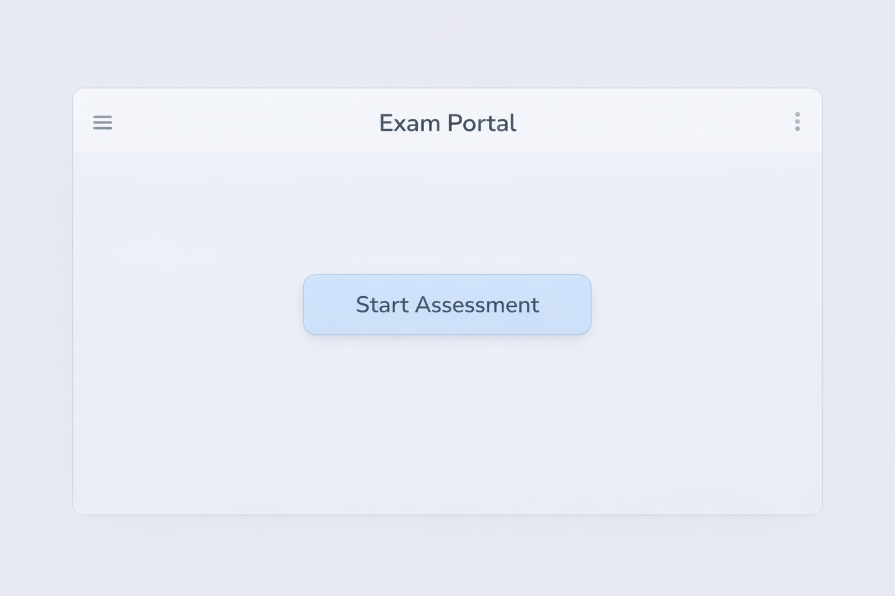
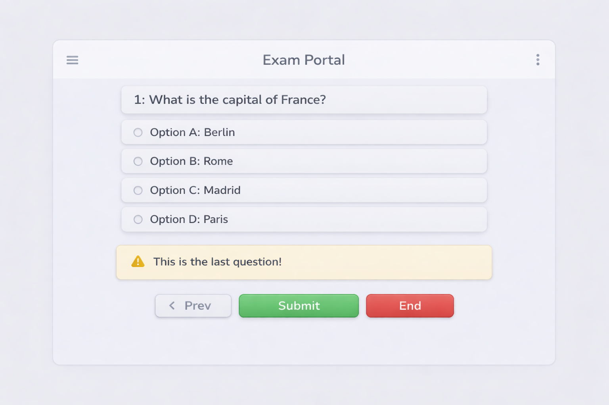
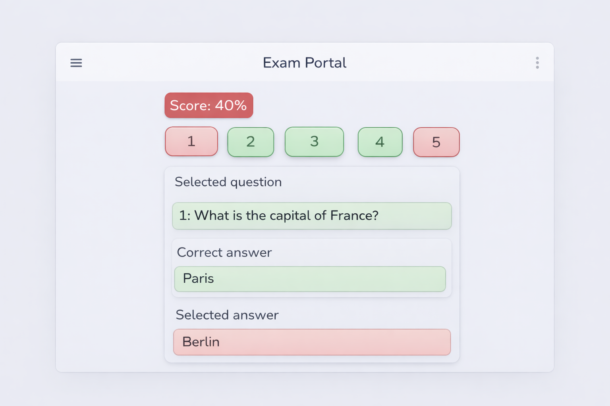

# react-exam-portal
# React Assessment App UI Challenge

A UI-focused React challenge to build a simple online assessment (exam) interface.

This project is ideal for beginners who want to practice:

- Component decomposition  
- Props & state basics  
- Layout and styling  
- Clean UI structure  
- Desktop-first responsive design  

> This is a **frontend UI challenge**, not a full backend-powered exam system.

---

## Challenge Overview

Build a 3-screen assessment application UI using React based on provided wireframes.

The application should simulate a basic exam flow:

1. Start Exam  
2. Answer Questions  
3. View Score & Review  

---

## Objective

Design and implement a clean, reusable, and well-structured React UI that mimics a real online assessment portal.

Focus on:

- UI structure  
- Component design  
- State handling  
- Visual feedback  

---

## Screens to Implement

---

## Screen 1 — Start Exam



### Features

- Title: **Exam Portal**
- Centered layout
- Prominent **Start Assessment** button
- Minimal and clean UI
- Desktop-first design

### Behavior

- Clicking **Start Assessment** navigates to Screen 2

---

## Screen 2 — Question Screen



### Features

- Header with app title
- Question text
- Four options (A–D)
- Navigation controls:
  - Prev  
  - Next / Submit  
  - End  
- Last-question notification

Example:

`⚠️ This is the last question!`


### Behavior

- Selecting an option highlights it
- Prev/Next navigates questions
- Last question shows warning
- End button moves to Score Screen

---

## Screen 3 — Score & Review



### Features

- Score display (e.g., `Score: 40%`)
- Question number indicators
  - 🟢 Green → correct  
  - 🔴 Red → incorrect  
- Review panel:
  - Selected Question  
  - Correct Answer  
  - Selected Answer  

### Behavior

- Clicking a question number shows its review
- Color-coded correctness feedback

---

## Suggested Component Structure

```text
App
 |__src/
    │
    ├── pages/
    │ ├── StartPage.jsx
    │ ├── ExamPage.jsx
    │ └── ReviewPage.jsx
    │
    ├── components/
    │ ├── layout/
    │ │ ├── Header.jsx
    │ │ └── Container.jsx
    │ │
    │ ├── exam/
    │ │ ├── QuestionCard.jsx
    │ │ ├── OptionItem.jsx
    │ │ ├── NavigationBar.jsx
    │ │ └── LastQuestionAlert.jsx
    │ │
    │ └── review/
    │ ├── ScoreBadge.jsx
    │ ├── QuestionNavigator.jsx
    │ └── ReviewPanel.jsx
    │
    ├── data/
    │ └── questions.js
    │
    ├── styles/
    │ └── global.css
    │
    ├── App.jsx
    └── main.jsx
```
---

## UI Guidelines

- Desktop-first layout  
- Soft shadows & rounded corners  
- Consistent spacing  
- Clean typography  

### Core Color Palette

| Purpose | Color | Hex Code |
|--------|------|---------|
| Primary | Soft Blue | #4F8EF7 |
| Primary Light | Light Blue | #DCEBFF |
| Success | Green | #4CAF50 |
| Success Light | Light Green | #DFF5E4 |
| Danger | Red | #E74C3C |
| Danger Light | Light Red | #FDE2E0 |
| Warning | Amber | #F4B400 |
| Background | Light Grey | #F5F7FA |
| Card Background | White | #FFFFFF |
| Border | Soft Grey | #E0E0E0 |
| Text Primary | Dark Grey | #333333 |
| Text Secondary | Medium Grey | #666666 |

---
## Page-wise Color Usage

### NavigationBar

### Next / Submit Button

- Background → `#4CAF50`
- Text → `#FFFFFF`
- Hover → `#43A047`

### Prev Button

- Background → `#E0E0E0`
- Text → `#333333`

### End Button

- Background → `#E74C3C`
- Text → `#FFFFFF`

### Why?

- Green → positive progression  
- Red → exit/end action  
- Grey → neutral navigation  

---

## LastQuestionAlert

- Background → `#FFF4E5`
- Border → `#F4B400`
- Text → `#996C00`

--- 

### Start Page

### Background

- Page Background → `#F5F7FA`
- Card/Container → `#FFFFFF`

### Header

- Text → `#333333`
- Border bottom → `#E0E0E0`

### Start Button

- Background → `#4F8EF7`
- Text → `#FFFFFF`
- Hover → `#3A78E0`

---

### Exam Page

---

## Question Card

- Background → `#FFFFFF`
- Border → `#E0E0E0`
- Question Text → `#333333`

---

## OptionItem

### Default

- Background → `#FFFFFF`
- Border → `#E0E0E0`

### Selected

- Background → `#DCEBFF`
- Border → `#4F8EF7`

### Hover

- Background → `#F0F6FF`

---

## Review Page

---

## ScoreBadge

### Good Score

- Background → `#4CAF50`
- Text → `#FFFFFF`

### Low Score

- Background → `#E74C3C`
- Text → `#FFFFFF`

---

## QuestionNavigator

### Correct

- Background → `#DFF5E4`
- Border → `#4CAF50`
- Text → `#2E7D32`

### Incorrect

- Background → `#FDE2E0`
- Border → `#E74C3C`
- Text → `#C62828`

### Unvisited (optional)

- Background → `#EEEEEE`
- Text → `#666666`

---

## ReviewPanel

### Correct Answer

- Background → `#DFF5E4`
- Border → `#4CAF50`

### Selected Wrong Answer

- Background → `#FDE2E0`
- Border → `#E74C3C`

---

## Tech Stack

### Required

- React (Vite or CRA)
- CSS / CSS Modules / Tailwind

### Optional

- React Router  
- Framer Motion  
- LocalStorage  

---

## Bonus Challenges

Want to go further?

- Add a timer  
- Add progress bar  
- Add animations  
- Save answers to localStorage  
- Dark mode  
- Tablet responsiveness  

---

## Learning Outcomes

By completing this challenge, you will practice:

- Component-based architecture  
- State management basics  
- Props usage  
- Conditional rendering  
- UI layout design  
- Clean project organization  

---

## Final Goal

Build a professional-looking assessment UI that:

- Matches the wireframes  
- Uses reusable components  
- Demonstrates good React practices  
- Feels like a real product UI  

---

## License

This project is open-source and free to use for learning purposes.
